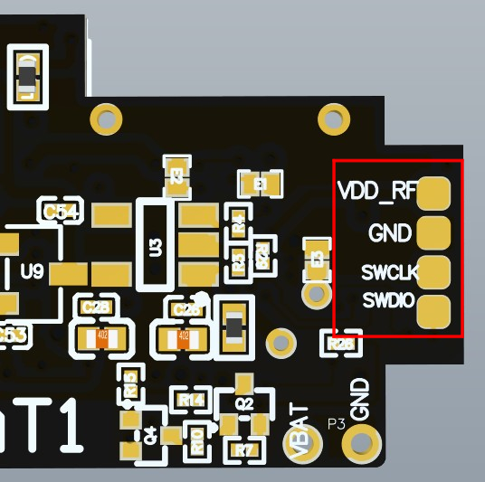
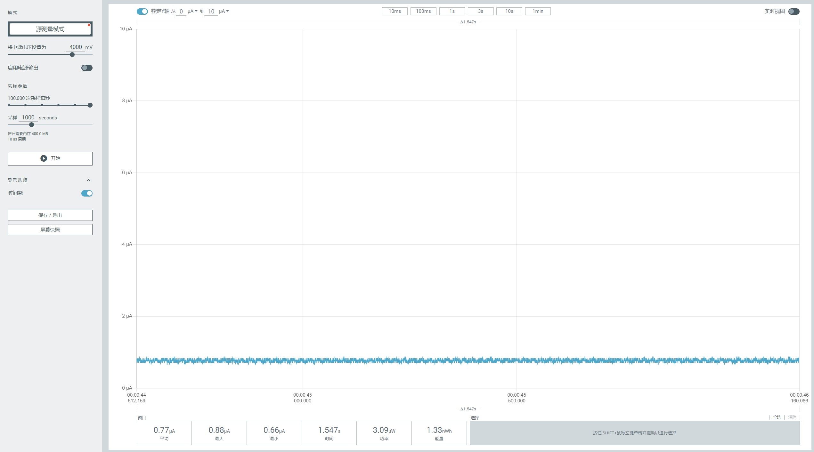

<!--
 * @Description: None
 * @Author: LILYGO_L
 * @Date: 2023-09-11 16:13:14
 * @LastEditTime: 2025-10-16 11:40:33
 * @License: GPL 3.0
-->
<h1 align = "center">T-Impulse-Plus</h1>

    

## **English | [中文](./README_CN.md)**

## Version iteration:
| Version                              | Update date                       |
| :-------------------------------: | :-------------------------------: |
| T-Impulse-Plus_V1.0            | 2025-06-18                         |

## PurchaseLink
| Product                     | SOC           |  FLASH  |  PSRAM   | Link                   |
| :------------------------: | :-----------: |:-------: | :---------: | :------------------: |
| T-Impulse-Plus_V1.0   | nRF52840 |   1M   |256kB| NULL |

## Directory
- [Describe](#describe)
- [Preview](#preview)
- [Module](#module)
- [SoftwareDeployment](#SoftwareDeployment)
- [PinOverview](#pinoverview)
- [RelatedTests](#RelatedTests)
- [FAQ](#faq)
- [Project](#project)

## Describe

T-Impulse Plus is a low-power bracelet developed based on the nRF52840 chip, featuring a more power-efficient design. Its minimum deep sleep power consumption can reach 10μA to 40μA (actual power consumption may vary depending on the onboard components of different boards; the minimum power consumption here is based on the engineering board measured by the LILYGO laboratory). The shutdown power consumption is below 1μA. With a wealth of onboard features such as an inertial sensor, LoRa module, and GPS, along with its exceptional power performance, the T-Impulse Plus delivers outstanding battery life.

## Preview

### Actual Product Image

<!-- 

    

---

    

---

    

 -->

## Module

### 1. MCU

* Chip: nRF52840
* RAM: 256kB
* FLASH: 1MB
* Related Documentation:
    >[nRF52840_Datasheet](https://docs.nordicsemi.com/bundle/ps_nrf52840/page/keyfeatures_html5.html)

### 2. Display

* Resolution: 128x64px
* Display Type: OLED
* Driver Chip: SSD1306
* Bus Communication Protocol: IIC
* Dependent Libraries:
    >[Adafruit_BusIO-1.16.1](./libraries/Adafruit_BusIO-1.16.1/)  
    >[Adafruit-GFX-Library-1.11.10](./libraries/Adafruit-GFX-Library-1.11.10/)
* Related Documentation:
    >[SSD1306](./information/SSD1306.pdf)

### 3. LORA

* Chip Module: S62F
* Chip: SX1262
* Bus Communication Protocol: SPI
* Dependent Libraries:
    >[RadioLib](./libraries/RadioLib-7.1.2/)  
    >[Adafruit_BusIO-1.16.1](./libraries/Adafruit_BusIO-1.16.1/)  
    >[Adafruit_SPIFlash-4.3.4](./libraries/Adafruit_SPIFlash-4.3.4/)
* Related Documentation:
    >[S62F](./information/S62F.pdf)

### 4. GPS

* Chip: MIA-M10Q
* Bus Communication Protocol: UART
* Dependent Libraries:
    >[TinyGPSPlus-1.0.3a](./libraries/TinyGPSPlus-1.0.3a/)  
    > [cpp_bus_driver](https://github.com/Llgok/cpp_bus_driver)
* Related Documentation:
    >[MIA-M10Q](./information/MIA-M10Q-00B.pdf)

### 5. IMU

* Chip: ICM20948
* Bus Communication Protocol: IIC
* Dependent Libraries:
    >[ICM20948_WE-1.1.11](./libraries/ICM20948_WE-1.1.11/)
* Related Documentation:
    >[ICM20948](./information/ICM20948.pdf)

### 6. Flash

* Chip: ZD25WQ32CEIGR
* Bus Communication Protocol: SPI
* Dependent Libraries:
    >[Adafruit_BusIO-1.16.1](./libraries/Adafruit_BusIO-1.16.1/)  
    >[Adafruit_SPIFlash-4.3.4](./libraries/Adafruit_SPIFlash-4.3.4/)
* Related Documentation:
    >[ZD25WQ32CEIGR](./information/ZD25WQ32CEIGR.pdf)

### 7. Touch Button

* Chip: TTP223
* Other Notes: Configured for falling edge trigger. This chip is also used as the Bluetooth firmware download trigger button. Usage for Bluetooth firmware download is special: if held down continuously during the power-on stage, the button trigger will not function. To successfully trigger Bluetooth firmware download mode, the RST pin must be pressed first, then after waiting for 1 second, this button must be pressed.
* Related Documentation:
    >[TTP223](./information/TTP223-BA6-TD.pdf)

### 8. Power Management IC

* Chip: SGM41562
* Other Notes: This chip is used for main power switch control.
* Dependent Libraries:
    > [cpp_bus_driver](https://github.com/Llgok/cpp_bus_driver)
* Related Documentation:
    >[SGM41562](./information/SGMICRO-SGM41562XGTR.pdf)

## SoftwareDeployment

### Examples Support

| Example | `[Arduino IDE (Adafruit_nRF52_V1.6.1)]`   `[PlatformIO (nordicnrf52_V10.6.0)]`   Support | Description | Picture |
| ------  | ------  | ------ | ------ | 
| [Battery_Measurement](./examples/Battery_Measurement) | 
![alt text][supported]  |  |  |
| [BLE_Uart](./examples/BLE_Uart) | 
![alt text][supported]  |  |  |
| [Display](./examples/Display) | 
![alt text][supported]  |  |  |
| [Display_GPS_BLE_Uart](./examples/Display_GPS_BLE_Uart) | 
![alt text][supported]  |  |  |
| [Flash](./examples/Flash) | 
![alt text][supported]  |  |  |
| [Flash_Erase](./examples/Flash_Erase) | 
![alt text][supported]  |  |  |
| [Flash_Speed_Test](./examples/Flash_Speed_Test) | 
![alt text][supported]  |  |  |
| [GPS](./examples/GPS) | 
![alt text][supported]  |  |  |
| [gps_2](./examples/gps_2) | 
![alt text][supported]  |  |  |
| [GPS_Full](./examples/GPS_Full) | 
![alt text][supported]  |  |  |
| [ICM20948](./examples/ICM20948) | 
![alt text][supported]  |  |  |
| [IIC_Scan_2](./examples/IIC_Scan_2) | 
![alt text][supported]  |  |  |
| [original_test](./examples/original_test) |
![alt text][supported]  | Product factory original testing |  |
| [sgm41562](./examples/sgm41562) | 
![alt text][supported]  |  |  |
| [SX126x_PingPong](./examples/SX126x_PingPong) | 
![alt text][supported]  |  |  |
| [SX126x_PingPong_2](./examples/SX126x_PingPong_2) | 
![alt text][supported]  |  |  |
| [sx126x_tx_continuous_wave](./examples/sx126x_tx_continuous_wave) | 
![alt text][supported]  |  |  |
| [ttp223](./examples/ttp223) | 
![alt text][supported]  |  |  |

[supported]: https://img.shields.io/badge/-supported-green "example"

| Bootloader | Description | Picture |
| ------  | ------  | ------ |
| [bootloader](./bootloader/) |  |  |

| Firmware | Description | Picture |
| ------  | ------  | ------ |
| [original_test](./firmware/[T-Impulse-Plus_V1.0][original_test(lora_freq_910mhz)]_firmware/)| Product factory original testing |  |

### IDE and Flashing

#### PlatformIO
1. Install [VisualStudioCode](https://code.visualstudio.com/Download),choose installation based on your system type.

2. Open the "Extension" section of the Visual Studio Code software sidebar (Alternatively, use "<kbd>Ctrl</kbd>+<kbd>Shift</kbd>+<kbd>X</kbd>" to open the extension). Search for the "PlatformIO IDE" extension and download it.

3. During the installation of the extension, you can go to GitHub to download the program. You can download the main branch by clicking on the "<> Code" with green text, or you can download the program versions from the "Releases" section in the sidebar.

4. After the installation of the extension is completed, open the Explorer in the sidebar (Alternatively, use "<kbd>Ctrl</kbd>+<kbd>Shift</kbd>+<kbd>E</kbd>" go open it). Click on "Open Folder", locate the project code you just downloaded (the entire folder), and click "Add." At this point, the project files will be added to your workspace.

5. Open the "platformio.ini" file in the project folder (PlatformIO will automatically open the "platformio.ini" file corresponding to the added folder). Under the "[platformio]" section, uncomment and select the example program you want to burn (it should start with "default_envs = xxx") Then click "<kbd>[√](image/4.png)</kbd>" in the bottom left corner to compile. If the compilation is correct, connect the microcontroller to the computer and click "<kbd>[→](image/5.png)</kbd>" in the bottom left corner to download the program.

6. At this point, an error may occur, and you need to install [Python](https://www.python.org/downloads/). Open the folder "tool" -> "win10 vscode platformio start" sequentially, and execute the cmd command `python t_impulse_plus_setup.py` under the "win10 vscode platformio start" folder. This will complete the development board installation, and the compilation and flashing will no longer report errors.

#### Arduino

1. Install [Arduino](https://www.arduino.cc/en/software), and select the installation based on your system type.

2. Open the "example" directory of the project folder, select the example project folder, and open the file ending with ".ino" to open the Arduino IDE project workspace.

3. Open the "Tools" menu bar at the top right -> Select "Board" -> "Board Manager", find or search for "Adafruit_nRF52", and download the board file with the author named "Adafruit". Then return to the "Board" menu bar, select the board type under the "Adafruit_nRF52" board, and the selected board type is determined by the "board = xxx" header under the [env] directory in the "platformio.ini" file. If there is no corresponding board, you need to manually add the board under the "board" directory in the project folder. (If "Adafruit_nRF52" cannot be found, you need to open Preferences -> Add `https://www.adafruit.com/package_adafruit_index.json` to "Additional Board Manager URLs")
    
4. Open the menu bar "[File](image/6.png)" -> "[Preferences](image/6.png)", find the "[Project Folder Location](image/7.png)" section, and copy and paste all the library files along with the folders in the "libraries" folder under the project directory into the "libraries" folder in this directory.
    
5. Select the correct settings in the "Tools" menu, as shown in the table below.
    
| Setting                               | Value                                 |
| :-------------------------------: | :-------------------------------: |
| Board                                 | Nordic nRF52840 DK           |

6.  Select the correct port.

7. Entering Bootloader Download Mode: Press and release the RST (reset) chip button, wait for 1 second (this wait is essential), then press and release the RST button again. Once a new drive letter appears on the computer, it indicates that the device has successfully entered the bootloader download mode.

8.  Click the top right "[√](image/8.png)" to compile. If there are no errors, connect the microcontroller to the computer and click the top right "[→](image/9.png)" to start the flashing process.

#### JLINK Flashing Firmware and Bootloader

1.  Install the software [nRF-Connect-for-Desktop](https://www.nordicsemi.com/Products/Development-tools/nRF-Connect-for-Desktop/Download#infotabs)

2.  Install the software [JLINK](https://www.segger.com/downloads/jlink/)

3.  Connect the JLINK pins correctly as shown in the figure below

    

4.  Open the software nRF-Connect-for-Desktop and install the tool [Programmer](./image/10.png) and open it

5.  Add files, select both the bootloader file and the firmware file at the same time, click [Erase&write](./image/11.png), and the flashing will be completed.

## PinOverview

For pin definitions, please refer to the configuration file: 
 

[pin_config.h](./libraries/private_library/pin_config.h)

### Power Dissipation

| Firmware | Software | Description | Picture |
| ------  | ------  | ------ | ------ | 
| [original_test](./firmware/[T-Impulse-Plus_V1.0][original_test(lora_freq_910mhz)]_firmware) | `original_test` | Minimum Power Consumption: 0.77μA   For more information, please check the [Power Consumption Test Log](./relevant_test/PowerConsumptionTestLog_[T-Impulse-Plus]_20250825.pdf) | 
  
 |

## FAQ

* Q. After reading the above tutorials, I still don't know how to build a programming environment. What should I do?
* A. If you still don't understand how to build an environment after reading the above tutorials, you can refer to the [LilyGo-Document](https://github.com/Xinyuan-LilyGO/LilyGo-Document) document instructions to build it.

 

* Q. Why does Arduino IDE prompt me to update library files when I open it? Should I update them or not?
* A. Choose not to update library files. Different versions of library files may not be mutually compatible, so it is not recommended to update library files.

 

* Q. Why is there no debug information output from my board's USB?
* A. Please enable the "DTR" option in your serial assistant software.

 

*   Q. Why does the board always fail to program when I directly use USB?
*   A. Please press and release the RST (reset) chip button, wait for 1 second (this wait is essential), then press and release the RST button again. Once a new drive letter appears on the computer, it indicates that the device has entered the bootloader download mode, and programming can now proceed.

 

## Project
* [T-Impulse-Plus_V1.0](./project/T-Impulse-Plus_V1.0.pdf)
