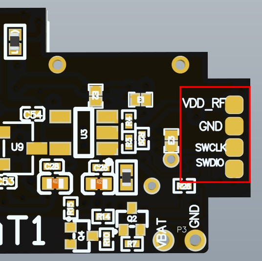
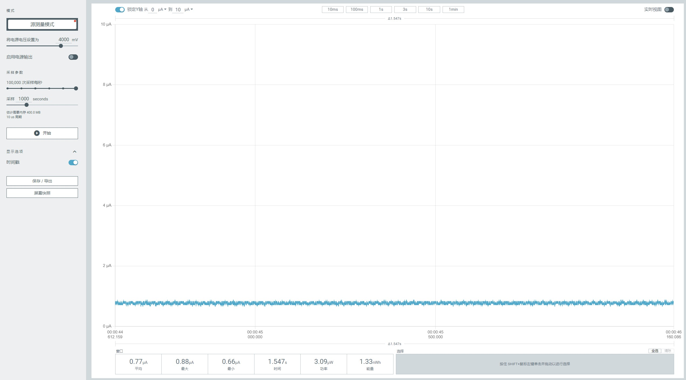

<!--
 * @Description: None
 * @Author: LILYGO_L
 * @Date: 2025-10-11 13:45:15
 * @LastEditTime: 2025-10-16 13:46:47
 * @License: GPL 3.0
-->

<h1 align = "center">T-Impulse-Plus</h1>

    

## **[English](./README.md) | 中文**

## 版本迭代:
| Version                               | Update date                       |
| :-------------------------------: | :-------------------------------: |
| T-Impulse-Plus_V1.0            | 2025-06-18                         |

## 购买链接
| Product                     | SOC           |  FLASH  |  RAM   | Link                   |
| :------------------------: | :-----------: |:-------: | :---------: | :------------------: |
| T-Impulse-Plus_V1.0   | nRF52840 |   1M   |256kB| NULL |

## 目录
- [描述](#描述)
- [预览](#预览)
- [模块](#模块)
- [软件部署](#软件部署)
- [引脚总览](#引脚总览)
- [相关测试](#相关测试)
- [常见问题](#常见问题)
- [项目](#项目)

## 描述

T-Impulse-Plus是基于nRF52840芯片开发的低功耗手环，拥有更低的功耗设计，最低深度睡眠功耗可达10μA-40μA（不同板子由于板载元器件差异功耗的表现可能不同，这里最低功耗采用LILYGO实验室测定的工程板），关机功耗为1μA以下，板载丰富的功能，惯性传感器、LORA模块、GPS等功能。

## 预览

### 实物图

<!-- 

    

---

    

---

    

 -->

## 模块

### 1. MCU

* 芯片：nRF52840
* RAM：256kB
* FLASH：1M
* 相关资料：
    >[nRF52840_Datasheet](https://docs.nordicsemi.com/bundle/ps_nrf52840/page/keyfeatures_html5.html)

### 2. 屏幕

* 分辨率：128x64px
* 屏幕类型：OLED
* 驱动芯片：SSD1306
* 总线通信协议：IIC
* 依赖库：
    >[Adafruit_BusIO](https://github.com/adafruit/Adafruit_BusIO)  
    >[Adafruit-GFX-Library](https://github.com/adafruit/Adafruit-GFX-Library)
* 相关资料：
    >[SSD1306](./information/SSD1306.pdf)

### 3. LORA

* 芯片模组：S62F
* 芯片：SX1262
* 总线通信协议：SPI
* 依赖库：
    >[RadioLib](https://github.com/jgromes/RadioLib)  
    >[Adafruit_BusIO](https://github.com/adafruit/Adafruit_BusIO)  
    >[Adafruit_SPIFlash](https://github.com/adafruit/Adafruit_SPIFlash)
* 相关资料：
    >[S62F](./information/S62F.pdf)  

### 4. GPS

* 芯片：MIA-M10Q
* 总线通信协议：UART
* 依赖库：
    >[TinyGPSPlus](https://github.com/mikalhart/TinyGPSPlus)  
    >[cpp_bus_driver](https://github.com/Llgok/cpp_bus_driver)
* 相关资料：
    >[MIA-M10Q](./information/MIA-M10Q-00B.pdf)  

### 5. 惯性传感器

* 芯片：ICM20948
* 总线通信协议：IIC
* 依赖库：
    >[ICM20948_WE](https://github.com/wollewald/ICM20948_WE)
* 相关资料：
    >[ICM20948](./information/ICM20948.pdf)  

### 6. Flash

* 芯片：ZD25WQ32CEIGR
* 总线通信协议：SPI
* 依赖库：
    >[Adafruit_BusIO](https://github.com/adafruit/Adafruit_BusIO)  
    >[Adafruit_SPIFlash](https://github.com/adafruit/Adafruit_SPIFlash)  
* 相关资料：
    >[ZD25WQ32CEIGR](./information/ZD25WQ32CEIGR.pdf)  

### 7. 触摸按钮

* 芯片：TTP223
* 其他说明：配置为下降沿触发，该芯片同时用作蓝牙下载固件触发按键，在用作蓝牙下载固件的时候情况比较特殊，上电阶段一直长按，该按键将不会触发，必须在按下RST引脚后等待RST引脚1秒再按下该引脚，蓝牙下载固件模式才能正常触发
* 相关资料：
    >[TTP223](./information/TTP223-BA6-TD.pdf)  

### 8. 电源芯片

* 芯片：SGM41562
* 其他说明：使用该芯片进行总电源开关控制
* 依赖库：
    > [cpp_bus_driver](https://github.com/Llgok/cpp_bus_driver)
* 相关资料：
    >[SGM41562](./information/SGMICRO-SGM41562XGTR.pdf)  

## 软件部署

### 示例支持

| Example | `[Arduino IDE (Adafruit_nRF52_V1.6.1)]`   `[PlatformIO (nordicnrf52_V10.6.0)]`   Support | Description | Picture |
| ------  | ------  | ------ | ------ | 
| [Battery_Measurement](./examples/Battery_Measurement) | 
![alt text][supported]  |  |  |
| [BLE_Uart](./examples/BLE_Uart) | 
![alt text][supported]  |  |  |
| [Display](./examples/Display) | 
![alt text][supported]  |  |  |
| [Display_GPS_BLE_Uart](./examples/Display_GPS_BLE_Uart) | 
![alt text][supported]  |  |  |
| [Flash](./examples/Flash) | 
![alt text][supported]  |  |  |
| [Flash_Erase](./examples/Flash_Erase) | 
![alt text][supported]  |  |  |
| [Flash_Speed_Test](./examples/Flash_Speed_Test) | 
![alt text][supported]  |  |  |
| [GPS](./examples/GPS) | 
![alt text][supported]  |  |  |
| [gps_2](./examples/gps_2) | 
![alt text][supported]  |  |  |
| [GPS_Full](./examples/GPS_Full) | 
![alt text][supported]  |  |  |
| [ICM20948](./examples/ICM20948) | 
![alt text][supported]  |  |  |
| [IIC_Scan_2](./examples/IIC_Scan_2) | 
![alt text][supported]  |  |  |
| [original_test](./examples/original_test) |
![alt text][supported]  | 出厂测试程序 |  |
| [sgm41562](./examples/sgm41562) | 
![alt text][supported]  |  |  |
| [SX126x_PingPong](./examples/SX126x_PingPong) | 
![alt text][supported]  |  |  |
| [SX126x_PingPong_2](./examples/SX126x_PingPong_2) | 
![alt text][supported]  |  |  |
| [sx126x_tx_continuous_wave](./examples/sx126x_tx_continuous_wave) | 
![alt text][supported]  |  |  |
| [ttp223](./examples/ttp223) | 
![alt text][supported]  |  |  |

[supported]: https://img.shields.io/badge/-supported-green "example"

| Bootloader | Description | Picture |
| ------  | ------  | ------ |
| [bootloader](./bootloader/) |  |  |

| Firmware | Description | Picture |
| ------  | ------  | ------ |
| [original_test](./firmware/[T-Impulse-Plus_V1.0][original_test(lora_freq_910mhz)]_firmware/)| 出厂测试程序 |  |

### IDE和烧录

#### PlatformIO
1. 安装 [VisualStudioCode](https://code.visualstudio.com/Download)，根据你的系统类型选择安装。

2. 打开VisualStudioCode软件侧边栏的“扩展”（或者使用<kbd>Ctrl</kbd>+<kbd>Shift</kbd>+<kbd>X</kbd>打开扩展），搜索“PlatformIO IDE”扩展并下载。

3. 在安装扩展的期间，你可以前往GitHub下载程序，你可以通过点击带绿色字样的“<> Code”下载主分支程序，也通过侧边栏下载“Releases”版本程序。

4. 扩展安装完成后，打开侧边栏的资源管理器（或者使用<kbd>Ctrl</kbd>+<kbd>Shift</kbd>+<kbd>E</kbd>打开），点击“打开文件夹”，找到刚刚你下载的项目代码（整个文件夹），点击“添加”，此时项目文件就添加到你的工作区了。

5. 打开项目文件中的“platformio.ini”（添加文件夹成功后PlatformIO会自动打开对应文件夹的“platformio.ini”）,在“[platformio]”目录下取消注释选择你需要烧录的示例程序（以“default_envs = xxx”为标头），然后点击左下角的“<kbd>[√](image/4.png)</kbd>”进行编译，如果编译无误，将单片机连接电脑，点击左下角“<kbd>[→](image/5.png)</kbd>”即可进行烧录。

6. 此时可能会报错，你需要安装一个 [Python](https://www.python.org/downloads/) ，依次打开文件夹“tool”->“win10 vscode platformio start”，在“win10 vscode platformio start”文件夹下执行cmd命令`python t_impulse_plus_setup.py`，即可完成开发板安装，此时编译烧录就不会报错了。

#### Arduino
1. 安装 [Arduino](https://www.arduino.cc/en/software)，根据你的系统类型选择安装。

2. 打开项目文件夹的“example”目录，选择示例项目文件夹，打开以“.ino”结尾的文件即可打开Arduino IDE项目工作区。

3. 打开右上角“工具”菜单栏->选择“开发板”->“开发板管理器”，找到或者搜索“Adafruit_nRF52”，下载作者名为“Adafruit”的开发板文件。接着返回“开发板”菜单栏，选择“Adafruit_nRF52”开发板下的开发板类型，选择的开发板类型由“platformio.ini”文件中以[env]目录下的“board = xxx”标头为准，如果没有对应的开发板，则需要自己手动添加项目文件夹下“board”目录下的开发板。(如果找不到“Adafruit_nRF52”，则需要打开首选项 -> 添加 “https://www.adafruit.com/package_adafruit_index.json” 到“其他开发板管理地址”)

4. 打开菜单栏“[文件](image/6.png)”->“[首选项](image/6.png)”，找到“[项目文件夹位置](image/7.png)”这一栏，将项目目录下的“libraries”文件夹里的所有库文件连带文件夹复制粘贴到这个目录下的“libraries”里边。

5. 在 "工具 "菜单中选择正确的设置，如下表所示。

| Setting                               | Value                                 |
| :-------------------------------: | :-------------------------------: |
| Board                                 | Nordic nRF52840 DK           |

6. 选择正确的端口。

7. 开启引导下载模式：按一下RST芯片复位按键后松开等待1秒后（一定要等待1秒）再按一下RST按键后松开，观察到电脑端有新盘符弹出，即已进入引导下载模式。

8. 点击右上角“<kbd>[√](image/8.png)</kbd>”进行编译，如果编译无误，将单片机连接电脑，点击右上角“<kbd>[→](image/9.png)</kbd>”即可进行烧录。

#### JLINK烧录firmware和bootloader
1. 安装软件 [nRF-Connect-for-Desktop](https://www.nordicsemi.com/Products/Development-tools/nRF-Connect-for-Desktop/Download#infotabs)

2. 安装软件 [JLINK](https://www.segger.com/downloads/jlink/)

3. 正确连接JLINK引脚如下图

    

4. 打开软件nRF-Connect-for-Desktop 安装工具 [Programmer](./image/10.png) 并打开

5. 添加文件，同时选择bootloader文件和firmware文件，点击 [Erase&write](./image/11.png) ，即可完成烧录

## 引脚总览

引脚定义请参考配置文件：
 

[pin_config.h](./libraries/private_library/pin_config.h)

## 相关测试

### 功耗
| Firmware | Software| Description | Picture |
| ------  | ------  | ------ | ------ | 
| [original_test](./firmware/[T-Impulse-Plus_V1.0][original_test(lora_freq_910mhz)]_firmware) | `original_test` | 最低功耗: 0.77uA   更多信息请查看 [功耗测试日志](./relevant_test/PowerConsumptionTestLog_[T-Impulse-Plus]_20250825.pdf) | 
  
 |

## 常见问题

* Q. 看了以上教程我还是不会搭建编程环境怎么办？
* A. 如果看了以上教程还不懂如何搭建环境的可以参考[LilyGo-Document](https://github.com/Xinyuan-LilyGO/LilyGo-Document)文档说明来搭建。

 

* Q. 为什么打开Arduino IDE时他会提醒我是否要升级库文件？我应该升级还是不升级？
* A. 选择不升级库文件，不同版本的库文件可能不会相互兼容所以不建议升级库文件。

 

* Q. 为什么我的板子USB输出不任何调试信息
* A. 请打开串口助手软件中的“DTR”选项

 

* Q. 为什么我直接使用USB烧录板子一直烧录失败呢？
* A. 请按一下RST芯片复位按键后松开等待1秒后（一定要等待1秒）再按一下RST按键后松开，观察到电脑端有新盘符，即已进入引导下载模式，这时候就能烧录了。

 

## 项目
* [T-Impulse-Plus_V1.0](./project/T-Impulse-Plus_V1.0.pdf)

